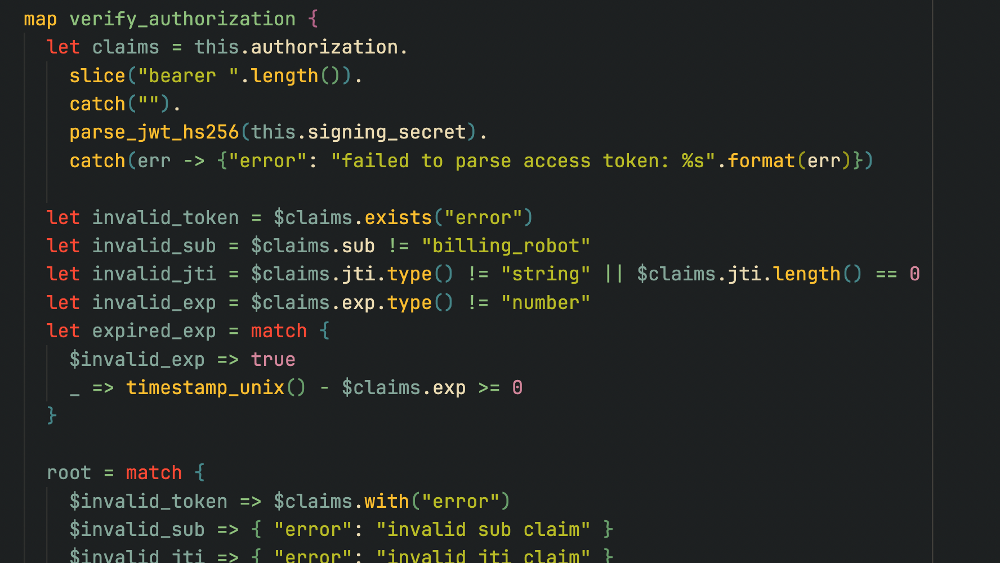
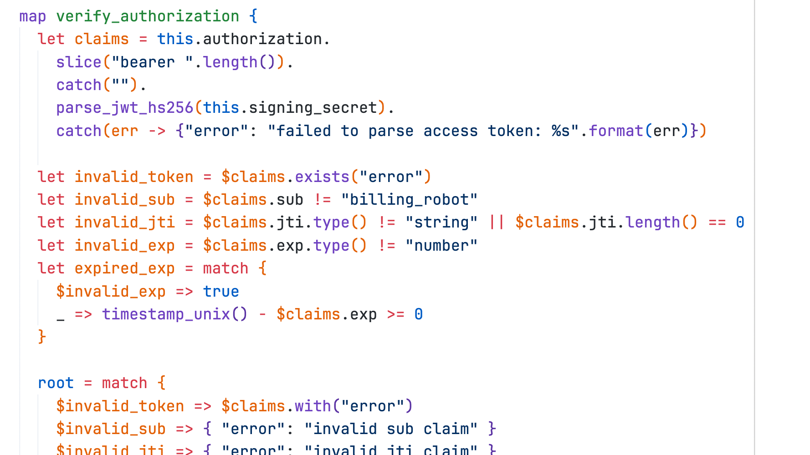
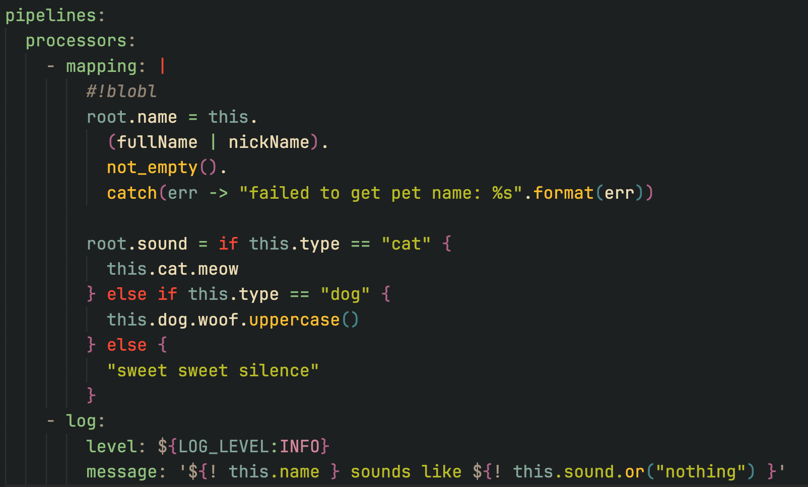

# vscode-benthos

> This extensions is in a very experimental stage. Please test it out and submit
> any issues you find!

The [Benthos][benthos] extension for Visual Studio Code adds syntax highlighting
support for the Bloblang language within YAML files (`.yaml`/`.yml`) and mapping
files (`.blobl`).




## Working with YAML

Bloblang string interpolations and environment variable references should get
enhanced with syntax highlighting.

Syntax highlighting for plugins or plugin config fields that accept bloblang
mappings can be enabled using the `#!blobl` pragma as the first line. Here's an
example when using the `mapping` processor:

```yaml
pipelines:
  processors:
    - mapping: |
        #!blobl
        root.name = this.
          (fullName | nickName).
          not_empty().
          catch(err -> "failed to get pet name: %s".format(err))

        root.sound = if this.type == "cat" {
          this.cat.meow
        } else if this.type == "dog" {
          this.dog.woof.uppercase()
        } else {
          "sweet sweet silence"
        }
    - log:
        level: ${LOG_LEVEL:INFO}
        message: '${! this.name } sounds like ${! this.sound.or("nothing") }'
```

This snippet would look something like the following screenshot with this
extension installed in VS Code.



[benthos]: https://www.benthos.dev/
